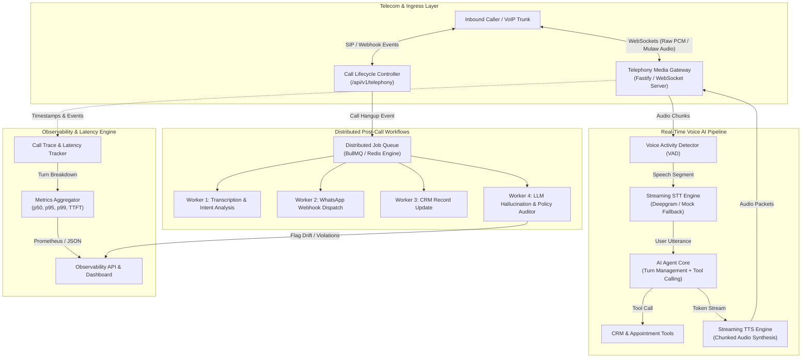

# 📞 OmniVoice-AI: Real-Time Telecom Voice Agent & Observability Gateway

[](https://www.typescriptlang.org/)
[](https://nodejs.org/)
[](https://fastify.dev/)
[](https://github.com/websockets/ws)
[](https://vitest.dev/)
[](https://www.docker.com/)

> **A distributed telecom backend engineered in Node.js/TypeScript that streams bidirectional VoIP audio over WebSockets, orchestrates conversational voice agents with tool execution, triggers asynchronous CRM/WhatsApp follow-ups, and tracks turn-by-turn latency waterfalls and automated hallucination audits.**

---

## 🎯 Engineering Rationale: Beyond Generic "AI Wrappers"

Most conversational AI projects are simple API wrappers around chat completion endpoints with high latency, zero voice protocol support, and no observability. In a real-world **DOT-licensed AI Telecom Operator** environment (handling millions of calls monthly):

1. **Sub-Second Audio Turnaround is Non-Negotiable**: Human conversations feel unnatural if turnaround latency exceeds **800ms - 1000ms**. Every millisecond of speech-to-text (STT), time-to-first-token (TTFT), and text-to-speech (TTS) must be instrumented.
2. **Deterministic Guardrails & Anti-Hallucination**: Voice agents talking directly to customers cannot promise unauthorized discounts or misquote uptime SLA terms without real-time compliance enforcement.
3. **Unified Single-Number Workflows**: Voice calls must seamlessly bridge into post-call messaging (WhatsApp confirmation) and CRM synchronization asynchronously without blocking the telephony gateway.



---

## ⏱️ Real-Time Turn Latency Waterfall Breakdown

The engine measures every phase of the conversational turn in milliseconds:

$$\text{Total Latency} = \underbrace{(T_{\text{STT}} - T_{\text{SpeechEnd}})}_{\text{Speech Recognition}} + \underbrace{(T_{\text{TTFT}} - T_{\text{STT}})}_{\text{Time to First Token}} + \underbrace{(T_{\text{TTS}} - T_{\text{TTFT}})}_{\text{Audio Synthesis}}$$

| Stage | Benchmark Target | Description |
| :--- | :--- | :--- |
| **STT Ingestion ($T_{\text{STT}}$)** | **150ms - 220ms** | Speech segment boundary detection and acoustic transcript decoding. |
| **LLM TTFT ($T_{\text{TTFT}}$)** | **200ms - 300ms** | Time elapsed until the first completion token is yielded. |
| **TTS First Chunk ($T_{\text{TTS}}$)** | **180ms - 250ms** | Synthesis and packetization of the first 20ms G.711 / PCM audio frame. |
| **Total Turnaround ($T_{\text{Total}}$)** | **~600ms - 850ms** | End-to-end round trip back to the caller's ear (well under the 1200ms SLA). |

---

## 🛡️ Business Guardrails & Hallucination Auditor

To safeguard telecom compliance, every agent response is validated through strict deterministic policies:
- **`POL-001` (Max Discount Threshold)**: Automatically blocks and flags any discount promise exceeding the authorized 15% threshold.
- **`POL-002` (Uptime Disclosure)**: Forbids false "100% zero downtime" claims.
- **`POL-003` (Trunk Pricing Guard)**: Prevents unverified custom SIP trunk rate quotes without sales engineer approval.
- **`POL-004` (Hostile Tone / Abuse Detection)**: Triggers instant handoff to human supervisor.

---

## 🚀 Getting Started

### Prerequisites
- Node.js 20+ (Node.js 22 LTS recommended)
- npm 10+

### 1. Installation
```bash
git clone https://github.com/roshani-005/OmniVoice-AI.git
cd OmniVoice-AI
npm install
```

### 2. Configure Environment
```bash
cp .env.example .env
```
*(No external API keys are required to test! The built-in high-fidelity simulator allows testing complete end-to-end calls out of the box).*

### 3. Run Development Server
```bash
npm run dev
```

Visit the interactive test dashboard at:
👉 **`http://localhost:3000`**

### 4. Run Automated Test Suite
```bash
npm test
```

### 5. Build for Production
```bash
npm run build
npm start
```

---

## 📡 REST & WebSocket API Reference

### Telephony Ingress
- `POST /api/v1/telephony/inbound`: Twilio / SIP-compatible webhook returning TwiML WebSocket stream instructions.
- `POST /api/v1/telephony/status`: Call lifecycle transition webhook.
- `POST /api/v1/telephony/simulate-call`: Programmatic voice call test runner.
- `WS /media-stream`: Full-duplex WebSocket audio streaming endpoint.

### Observability & Metrics
- `GET /api/v1/observability/metrics`: System-wide throughput, $p50, p90, p95, p99$ latencies, drop rate, and hallucination count.
- `GET /api/v1/observability/calls`: Historical call sessions with duration and sentiment.
- `GET /api/v1/observability/calls/:callId`: Deep-dive call trace with turn-by-turn latency waterfall, tool calls, and guardrail audit logs.
- `GET /api/v1/observability/crm`: Current state of CRM contacts, appointments, and sent WhatsApp messages.

---

## 📂 Project Structure

```text
omnivoice-ai/
├── src/
│   ├── agent/
│   │   ├── agent-core.ts         # Conversational Voice Agent & Barge-in
│   │   ├── guardrails.ts         # Policy Guardrails & Hallucination Auditor
│   │   └── tools.ts              # Appointment Booking & CRM Tools
│   ├── observability/
│   │   ├── metrics-aggregator.ts # System-wide percentiles (p50/p95/p99)
│   │   ├── routes.ts             # Observability REST endpoints
│   │   └── trace-tracker.ts      # Turn-by-Turn Latency Waterfall Builder
│   ├── queue/
│   │   ├── queue-manager.ts      # Asynchronous Distributed Job Queue
│   │   └── workers/
│   │       ├── crm-worker.ts     # CRM contact update worker
│   │       ├── eval-worker.ts    # Post-call hallucination auditor
│   │       ├── summary-worker.ts # Summarization & sentiment worker
│   │       └── whatsapp-worker.ts# WhatsApp follow-up dispatcher
│   ├── telephony/
│   │   ├── audio-processor.ts    # G.711 mu-law, VAD, and audio framing
│   │   ├── call-manager.ts       # Active call sessions & lifecycle
│   │   ├── media-stream.ts       # Bidirectional WebSocket audio stream
│   │   └── routes.ts             # Telephony webhooks & simulators
│   ├── config.ts                 # Zod-validated environment config
│   └── server.ts                 # Main Fastify application entrypoint
├── public/                       # Interactive Web Console & Simulator
│   ├── index.html
│   └── app.js
├── tests/                        # Vitest automated test suite
│   ├── agent-and-tools.test.ts
│   ├── guardrails.test.ts
│   ├── queue-pipeline.test.ts
│   └── trace-tracker.test.ts
├── Dockerfile                    # Lightweight multi-stage Docker build
├── docker-compose.yml
└── package.json
```

---

## 📜 License
MIT License. Built by Roshani Yadav.
